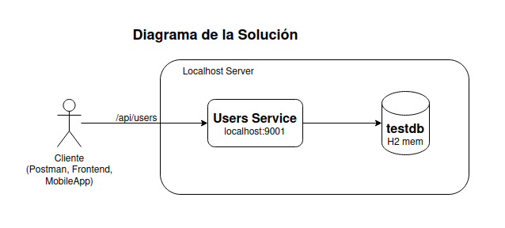

# Evaluación: JAVA
Desarrolle una aplicación que exponga una API RESTful de creación de usuarios.

Todos los endpoints deben aceptar y retornar solamente JSON, inclusive para los mensajes de error.

Todos los mensajes deben seguir el formato: ``` {"mensaje": "mensaje de error"} ```

## Registro
* Ese endpoint deberá recibir un usuario con los campos ```"nombre", "correo", "contraseña"```, más un listado de objetos ```"teléfono"```, respetando el siguiente formato:

    ```json
    {
        "name": "Juan Rodriguez",
        "email": "juan@rodriguez.org",
        "password": "hunter2",
        "phones": [
            {
                "number": "1234567",
                "citycode": "1",
                "countrycode": "57"
            }
        ]
    } 
    ```
* Responder el código de status HTTP adecuado
* En caso de éxito, retorne el usuario y los siguientes campos:
    - id: id del usuario (puede ser lo que se genera por el banco de datos, pero sería más deseable un UUID)
    - created: fecha de creación del usuario
    - modified: fecha de la última actualización de usuario
    - last_login: del último ingreso (en caso de nuevo usuario, va a coincidir con la fecha de creación)
    - token: token de acceso de la API (puede ser UUID o JWT)
    - isactive: Indica si el usuario sigue habilitado dentro del sistema.
*  Si caso el correo conste en la base de datos, deberá retornar un error "El correo ya se encuentra registrado"
* El correo debe seguir una expresión regular para validar que formato sea el correcto. (aaaaaaa@dominio.cl)
* La clave debe seguir una expresión regular para validar que formato sea el correcto. (El
  valor de la expresión regular debe ser configurable)
* El token deberá ser persistido junto con el usuario

## Technologías
* Java 17
* Maven
* Spring Boot 3.2
* Spring Web
* Spring Data JPA / Hibernate
* Spring Security
* JSON Web Tokens (JWT)
* BCrypt

## Como iniciar la solución
### Para comenzar con este proyecto, deberá tener instalado lo siguiente en su máquina local:

* JDK 17+
* Maven 3+

### Para compilar e iniciar el proyecto, siga estos pasos:

* Clonar el repositorio: `git clone `
* Construir los paquetes: `mvn clean install`
* Arrancar la aplicación : ` mvn spring-boot:run`


## Diagrama de Solución

